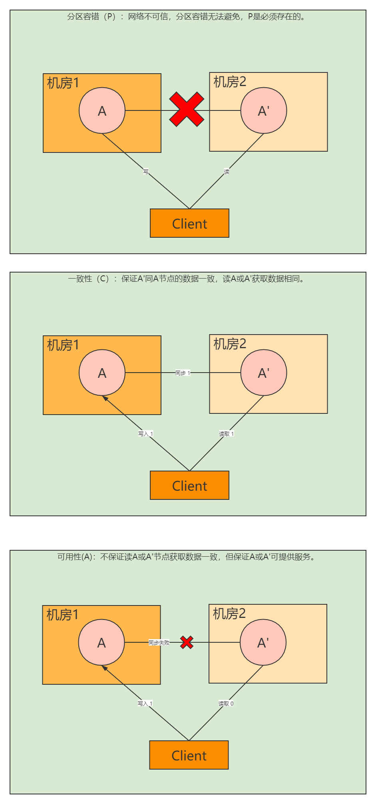
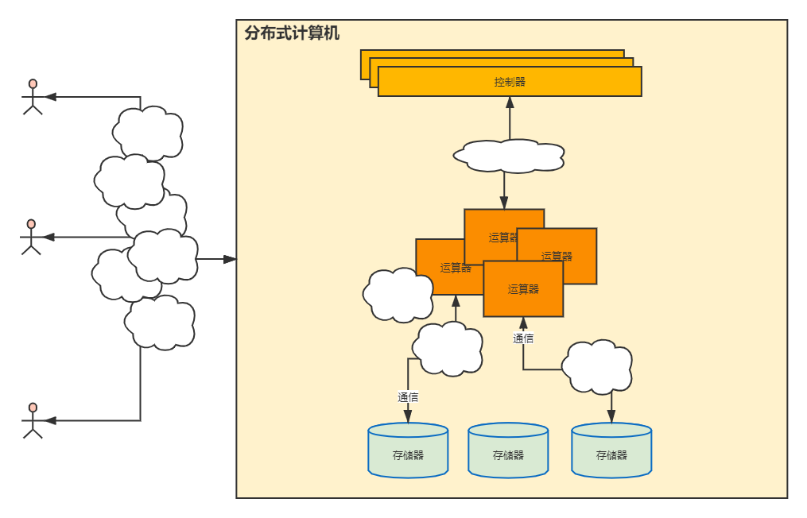

# CAP有关的分布式理论

**CAP**

1. C:consistency，一致性
2. A:avilability,可用性
3. P:partition tolerance，分区容错性。

**注：P是必须保留，系统设计时在C、A中取舍。**

### Base

> base是cap的理论延伸。base的三个方面。

1. basically avilable：基本可用
2. soft state:软状态即可存在中间状态
3. eventually consistent:最终一致性

**基本可用**

1. 服务降级
   1. 关闭次要功能，保证主流程可用。如电商大促时，关闭排行榜，推荐，确保商品交易主流程。
2. 流量削峰
   1. 高峰期把某些功能伸展时间，如预售商品支付延后十几分钟。
3. 延迟队列
   1. 使用队列，排队等待处理。

**软件状态和最终一致性**

> 允许系统中的数据存在中间状态，最终达到状态一致。

**分布式系统**

首先我们先理解下分布式系统，简单的来说可以把分布式系统理解为由网络组建成的计算机。从计算机的功能上来做拆解可分为如下组件。

1. 存储器
   1. 分布式存储，如nosql数据库存储。
2. 运算器
   1. 分布式计算，如分布式并行计算，MR。
3. 控制器
   1. 调度管理，如流量调度，任务调度，资源调度
4. 输入输出设备 
   1. 分布式系统的神经网络即通信，如同步RPC调用和异步消息队列。

