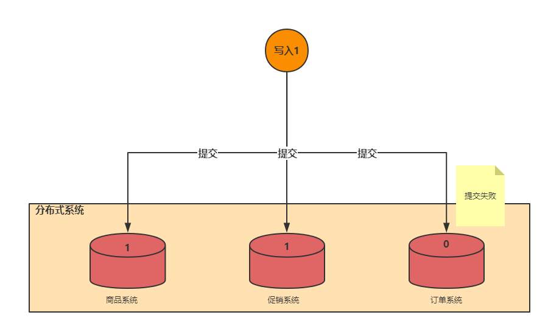
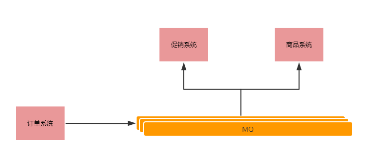
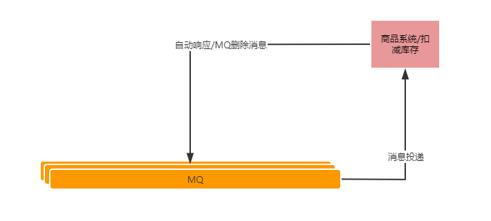
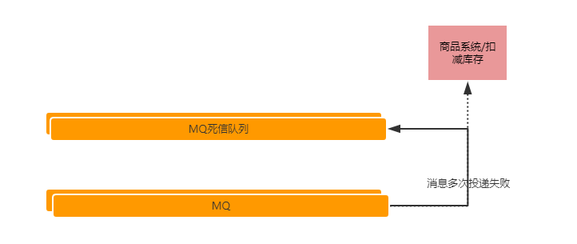
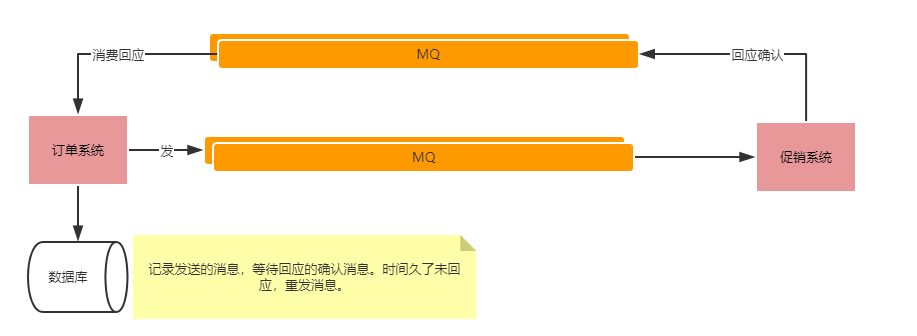

# 分布式事务一致性

**怎么样保证在分布式环境中事务的一致性？**

打个比方，商城系统中的商品系统，促销系统，订单系统，三个系统在下订单的场景下，商品扣减库存，促销扣减优惠卷，订单生成订单。怎么保持状态的一致性。

**我们先看下业内实用方案：基于MQ的可靠消息投递方案。**

通过放弃强一致性，选择最终一致性，提高系统的可用性，松耦合的可维护性及削峰的作用。

- 常用的市面MQ有Rabbit，RocketMQ。

- 注意消费消息时自动回应带来的消息丢失问题。改用编码式，业务完成后回应。

  

- 注意进入死信队列，人工方式参与的丢失消息问题。

  

- 建议使用可靠的双向消息确认架构

**理论上常见的解决方案**

- 2PC：Two-Phase Commit
  - 存在的问题
    - 死锁
    - 性能慢
    - 数据状态不一致
- 3PC：Three-Phase Commit
  - 存在的问题
    - 死锁
    - 性能慢
    - 数据状态不一致
- TCC：**Try-Confirm-Cancel,和2PC有些类似**
  - 存在的问题
    - 对应用的侵入性非常强
    - 实现难度也比较大

